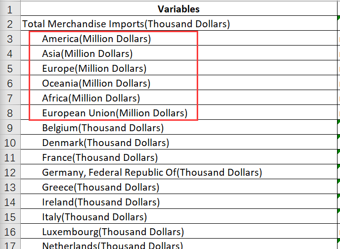
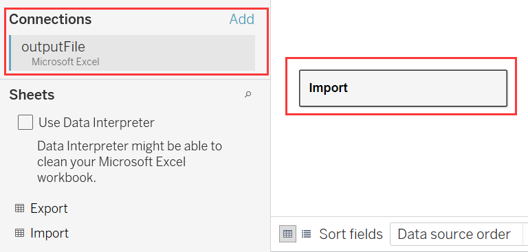

```{r setup, include=FALSE}
knitr::opts_chunk$set(echo = FALSE)
```

# 1.	Introduction

## 1.1 Data Source
The data visualisations, including the original one and the redesigned one, were created by using data provided by Department of Statistics, Singapore (DOS). The data are available under the sub-section of [Merchandise Trade by Region/Market](https://www.singstat.gov.sg/find-data/search-by-theme/trade-and-investment/merchandise-trade/latest-data) and are compiled by the Enterprise Singapore.

## 1.2 The Original Visualisation
The original data visualisation that will be assessed was shown in the following figure. This visualization shows the merchandise trade, including export and import, between Singapore and top six trading countries during the period from January 2011 to December 2020. 


*Figure 1*

# 2.	Critiques and Suggestions
## 2.1 Clarity
S/N | Critiques | Comments 
----|-----------|----------
1   |**There is not a title**: The lack of a title prevents the readers from quickly understanding the purpose of the visualisation. There are two notes for describing the information of this graph, but the long description is not so direct as a concise title.|Add a concise title, like "Singapore's Merchandise Trade Value with Ten Trading Partners, 2011-2020".
2   |**The lack of unit for x-axis and y-axis**: There are a series of numbers in x-axis and y-axis to show the values of exports and imports respectively, but there is not a label to show the unit of x-axis and y-axis.|Add the unit label of SGD in billion, "S$(Billion)" for x-axis and y-axis. 
3   |**The positions of titles for x-axis and y-axis are misleading**: Although the colors and icons can help readers to distinguish which axis is for import value and which axis is for export value, the unreasonable positions (at the beginning of each axis) of "Exports" and "Imports" for x-axis and y-axis are still very confusing.|Put the titles in the middle position of each axis.
4   |**There is not information about the study period**: We can't know the study period of this visualisation.|Add the period of "2011-2020" in the main title or add a note to show the period, "between January 2011-December 2020".
5   |**It is difficult to distinguish the import value and export value for each region**: Because there are a large amount of overlap parts among some bubbles or some centre points were covered by the tooltips of total trade value, we can't see all the centre points in the graph clearly. The hidden centre points prevent readers from knowing the import value and export value.|Make the size of each bubble smaller to show all the cretre points and move the positions of some tooltips.
6   |**The icons of "TOP NET EXPORTER" and "TOP NET IMPORTER" are confusing**: When readers firstly see the icons of  "TOP NET EXPORTER" and "TOP NET IMPORTER" in the graph, it is difficult for readers to know the meanings of the icons until they see the legends below. It is an indirect description.|Change the icons in the graph to texts of "TOP NET EXPORTER" and "TOP NET IMPORTER" and then remove the legend below.

## 2.2 Aesthetics
S/N | Critiques | Comments 
----|-----------|----------
1   |**The unreasonable layouts of the graph, the legend and notes**: The readers will be more easy to see the legend if the legend is closed to the graph part. However, positions of legends, "TOP NET EXPORTER" and "TOP NET IMPORTER", are below the note in this graph, the position is abnormal.At the same time, the abnormal layout causes the whole visualisation chaotic.| Put the legend on the left of the graph or above the note part.
2   |**Too large size of the bubbles**: Because there are some overlap part of bubbles due to the too large size, we can not see all the bubbles completely. Too large bubbles do not only cause difficulties in transferring information of the graph, but also cause the mussy layout.|Make the size of bubbles smaller.
3   |**Too many different fonts are used in this graph**: There are three different fonts are used in the part of graph, note and information description respectively. The inconsistent fonts will cause the all visualisation no so beautiful and professional.|Use the same font in the part of note and information description.
4   |**The background color of information description part is too dark**: The blue background color is more dark than other parts of this visualisation, so when readers see this visualisation, their attention will be caught by this part. The most important part, graph part, may not be focused on during readers' first reading.|Remove the background color of the information description part and change the font color to black as the font in note part.

# 3.	Proposed Visualisation
## 3.1 Sketch

*

## 3.2 Advantages of Proposed Design

# 4.	Data Visualisation Steps

## 4.1 Data Preparation
1) Download the dataset from the website of Department of Statistics, Singapore(DOS), and then open the file by Excel.Delete the unnecessary sheet of "Content" and then rename the sheets of "T1" and "T2" as "Import" and "Export".


2) Select the useless rows from 1 to 5 and from 100 to 112 in sheets of both "Import" and "Export", and then delete these selected rows.


3) Select the columns that are not in the study period, and then delete them in sheets of both "Import" and "Export".


4) After observing the values of dataset, we find that the unit for row 3 to 8 is different from other rows, so we should adjust the value to keep consistent unit. Enter "1000" in any empty cell, and copy it. Select the value part between row 3 and row 8, and then right click to choose "Paste Special". Under the function of Operation, the "Multiply" choice was selected, and then we clicked "OK". Do the same actions in both sheets, and clear the cell of "1000" after completing the above actions.



5. At last, save the file, "outputFile".

## 4.2 Import and Pivot Data
1) Import the file of "outputFile" into Tableau. And drag "Import" into the pane.


2) Select all the columns except the first column, and then right click to choose "Pivot".


3) Rename the pivoted columns to "Period" and "Imports" respectively.



5) Do the same actions in the sheet of "Export", and then save the file as "Export(outputFile)".


## 4.3 Data Visualisation
1.

## 4.4 Final Visualisation
1.

# 5.	Main Observations
**1)**
**2)**
**3)**
